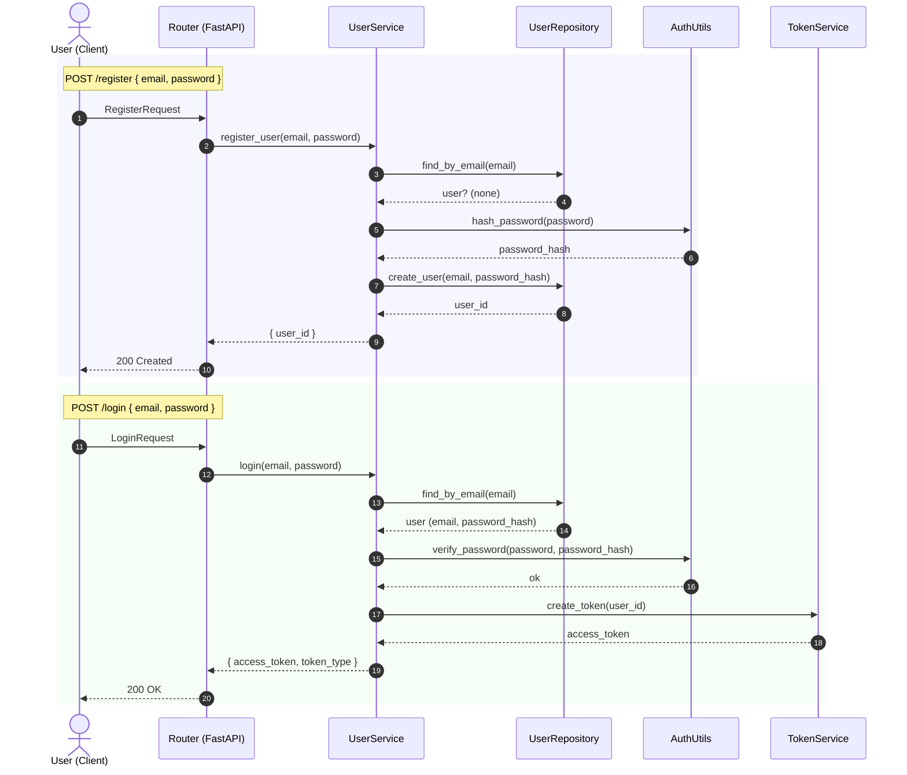
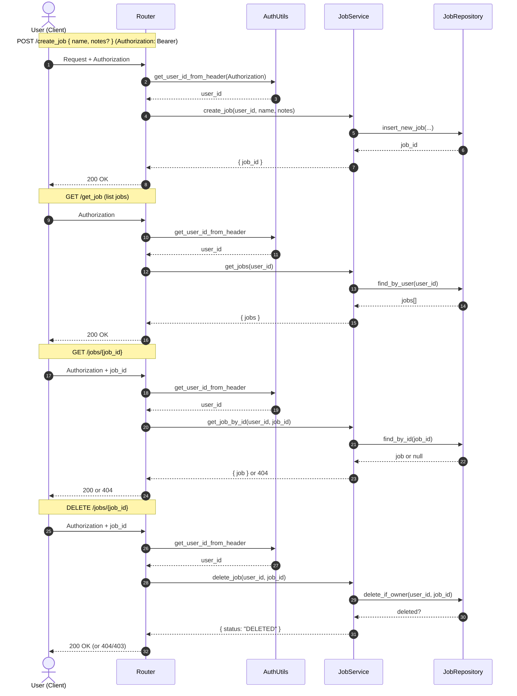
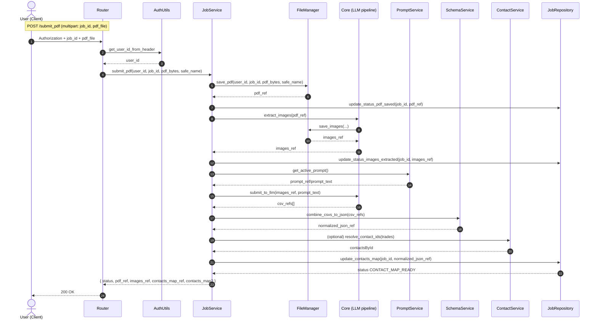

# 📐 UML Diagrams — Red Button (MVP)

This file contains **GitHub‑friendly Mermaid diagrams** that reflect the **current code** in `backend/router/handlers.py` and related services. Keep this as the editable source in `docs/uml/`. GitHub renders Mermaid inline — no image export needed. If you prefer PlantUML, you can mirror these in `.puml` files and (optionally) commit exported PNG/SVG alongside them.

> Last aligned with handlers that include: `/register`, `/login`, `/hello`, `/ping`, `/create_job`, `/get_job`, `GET /jobs/{job_id}`, `DELETE /jobs/{job_id}`, `POST /submit_pdf`, `GET|PATCH /jobs/{job_id}/contacts-map`.

---

## 1) Auth: Register & Login


---

## 2) Jobs: Create / List / Detail / Delete


---

## 3) PDF Pipeline: `/submit_pdf`


---

## 4) Contacts Map: Get & Patch
```mermaid
sequenceDiagram
    autonumber
    actor U as User (Client)
    participant R as Router
    participant AU as AuthUtils
    participant JS as JobService
    participant FM as FileManager
    participant JR as JobRepository

    rect rgba(245,245,255,0.6)
    Note over U,R: GET /jobs/{job_id}/contacts-map
    U->>R: Authorization + job_id
    R->>AU: get_user_id_from_header
    AU-->>R: user_id
    R->>JS: get_contacts_map(user_id, job_id)
    JS->>JR: assert_owner(user_id, job_id); get_contacts_map_ref(job_id)
    JR-->>JS: contacts_map_ref
    JS->>FM: load_json(contacts_map_ref)
    FM-->>JS: map JSON
    JS-->>R: { status:"OK", job_id, ref, map, contactsById }
    R-->>U: 200 OK
    end

    rect rgba(245,255,245,0.6)
    Note over U,R: PATCH /jobs/{job_id}/contacts-map { base_ref, ops[] }
    U->>R: Authorization + job_id + body
    R->>AU: get_user_id_from_header
    AU-->>R: user_id
    R->>JS: apply_contacts_map_ops(user_id, job_id, base_ref, ops)
    JS->>JR: assert_owner(user_id, job_id)
    JS->>JR: get_contacts_map_ref(job_id)
    JR-->>JS: current_ref
    JS->>FM: load_json(current_ref)
    FM-->>JS: current_map
    JS->>JS: apply ops → new_map
    JS->>FM: save_json(new_map)
    FM-->>JS: new_ref
    JS->>JR: update_contacts_map_ref(job_id, new_ref)
    JR-->>JS: ok
    JS-->>R: { ref:new_ref, map:new_map }
    R-->>U: 200 OK
    end
```

---

## 5) Notes on Keeping Diagrams in Sync
- **Source of truth**: keep these Mermaid diagrams in `docs/uml/uml_diagrams.md`.
- When you add new endpoints or services, update the relevant sequence.
- If you prefer PlantUML, create sibling files like `submit_pdf.puml` with the same logic.
- Consider a tiny checklist in PRs: “Updated UML if flow changed?” ✅

