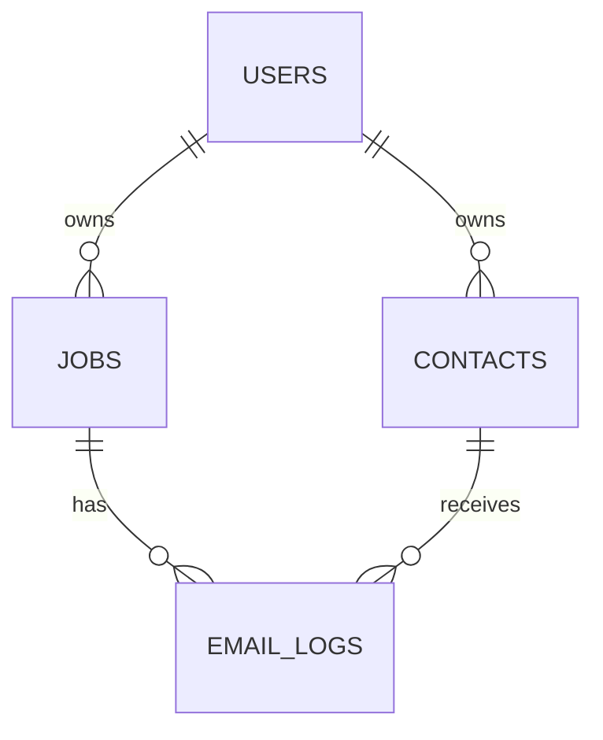

# 📚 Red Button — Database Design (MVP)

This document describes the **current** and **near‑term planned** database design for Red Button. The goal is to keep it practical for local development (SQLite) while making it easy to evolve toward Postgres later.

> **Scope note**: Sections are split into **Implemented** (in code now) and **Planned** (next migrations already referenced by services/routes).

---

## 🎯 Design Goals

* Keep schema **simple and explicit** for an MVP.
* Persist **job processing state** and **artifact references** (PDF, images, normalized JSON, contacts map) in a way that’s storage‑backend agnostic.
* Make it easy to **recompute** and **version** the contacts map.

---

## 🧱 Storage Model

Many columns store a serialized `StorageRef` (e.g., JSON string) pointing to where a file lives and how to fetch it. This keeps DB portable between **LOCAL** and **S3** (or future stores).

```json
{
  "mode": "LOCAL",
  "location": "C:/.../users/<uid>/jobs/<jobId>/pdfs/<file>.pdf"
}
```

Fields ending in `_ref` contain such references.

---

## 📄 Tables Overview

### 1) `users`  — *Implemented*

Holds authentication data. (Created in `UserRepository`.)

| Column          | Type      | Constraints                | Notes            |
| --------------- | --------- | -------------------------- | ---------------- |
| `user_id`       | TEXT      | PRIMARY KEY                | UUID             |
| `email`         | TEXT      | UNIQUE NOT NULL            | Lower-cased      |
| `password_hash` | TEXT      | NOT NULL                   | From `AuthUtils` |
| `created_at`    | TIMESTAMP | DEFAULT CURRENT\_TIMESTAMP |                  |

**Indexes**: UNIQUE on `email`.

---

### 2) `jobs`  — *Implemented*

Created in `JobRepository` (current code).

| Column       | Type      | Constraints                | Notes                                                      |
| ------------ | --------- | -------------------------- | ---------------------------------------------------------- |
| `job_id`     | TEXT      | PRIMARY KEY                | UUID                                                       |
| `user_id`    | TEXT      | NOT NULL                   | FK → users.user\_id (app‑enforced)                         |
| `name`       | TEXT      | NOT NULL                   |                                                            |
| `notes`      | TEXT      |                            |                                                            |
| `status`     | TEXT      |                            | e.g., `PDF_SAVED`, `IMAGES_EXTRACTED`, `CONTACT_MAP_READY` |
| `pdf_ref`    | TEXT      |                            | JSON `StorageRef`                                          |
| `images_ref` | TEXT      |                            | JSON `StorageRef` (folder/list)                            |
| `prompt_ref` | TEXT      |                            | JSON `StorageRef`                                          |
| `created_at` | TIMESTAMP | DEFAULT CURRENT\_TIMESTAMP |                                                            |

**Next planned columns** (already referenced in services):

| Column             | Type | Notes                                                                                                                                                                         |
| ------------------ | ---- | ----------------------------------------------------------------------------------------------------------------------------------------------------------------------------- |
| `contacts_map_ref` | TEXT | JSON `StorageRef` to the **current** contacts map JSON. *(You may also see this referred to as `mapped_contact_ref` in comments—use one name, recommend `contacts_map_ref`.)* |
| `jsons_mode`       | TEXT | Backend for JSON artifacts: `LOCAL`, `S3`, etc.                                                                                                                               |

---

### 3) `contacts` — *Planned (repository present, endpoints to come)*

Stores user‑owned address book entries that the mapping step can link to.

| Column       | Type      | Constraints                | Notes                  |
| ------------ | --------- | -------------------------- | ---------------------- |
| `contact_id` | TEXT      | PRIMARY KEY                | UUID                   |
| `user_id`    | TEXT      | NOT NULL                   | FK (app‑enforced)      |
| `name`       | TEXT      | NOT NULL                   |                        |
| `email`      | TEXT      |                            |                        |
| `phone`      | TEXT      |                            |                        |
| `trades`     | TEXT      |                            | CSV/JSON of trade tags |
| `zip_code`   | TEXT      |                            |                        |
| `website`    | TEXT      |                            |                        |
| `created_at` | TIMESTAMP | DEFAULT CURRENT\_TIMESTAMP |                        |

**Indexes**: `(user_id)`, and consider `(user_id, name)`.

---

### 4) `email_logs` — *Planned*

Records outbound emails to contacts for a job.

| Column        | Type      | Constraints                | Notes                             |
| ------------- | --------- | -------------------------- | --------------------------------- |
| `email_id`    | TEXT      | PRIMARY KEY                | UUID                              |
| `job_id`      | TEXT      | NOT NULL                   | FK (app‑enforced)                 |
| `contact_id`  | TEXT      | NOT NULL                   | FK (app‑enforced)                 |
| `status`      | TEXT      |                            | e.g., `QUEUED`, `SENT`, `BOUNCED` |
| `provider_id` | TEXT      |                            | Message ID from provider          |
| `created_at`  | TIMESTAMP | DEFAULT CURRENT\_TIMESTAMP |                                   |

Indexes: `(job_id)`, `(contact_id)`.

---

## 🔁 Contacts Map Versioning (File‑Backed)

* The **authoritative** contacts map is stored as a JSON file referenced by `jobs.contacts_map_ref`.
* When applying user edits via `PATCH /jobs/{job_id}/contacts-map`, write a **new** JSON file and update `contacts_map_ref` to that new ref.
* (Optional later) Keep a small `contacts_map_history` table to track prior refs for rollback/audit:

| Column       | Type      | Notes                     |
| ------------ | --------- | ------------------------- |
| `id`         | INTEGER   | PRIMARY KEY AUTOINCREMENT |
| `job_id`     | TEXT      |                           |
| `ref`        | TEXT      | JSON `StorageRef`         |
| `created_at` | TIMESTAMP |                           |

---

## 🗺️ ER Diagram (Mermaid)



> File artifacts (PDF, images, normalized JSON, contacts map) are **out‑of‑band** files referenced from `jobs.*_ref` columns via `StorageRef`.

---

## 🧪 States & Workflow (Job)

Typical status transitions:

```
NEW → PDF_SAVED → IMAGES_EXTRACTED → LLM_SUBMITTED → CONTACT_MAP_READY → (optional) EMAILED
```

* `submit_pdf` sets `PDF_SAVED`, fills `pdf_ref`.
* Image extraction fills `images_ref`.
* LLM + normalization yields a JSON (not necessarily stored in DB directly—referenced via files service), culminating in `contacts_map_ref` and `CONTACT_MAP_READY`.

---

## 🧰 Migrations (SQLite)

Keep migrations as **idempotent** SQL files in `migrations/` and apply in order.

**0001\_init\_jobs.sql** *(already effectively applied in code)*

```sql
CREATE TABLE IF NOT EXISTS jobs (
  job_id TEXT PRIMARY KEY,
  user_id TEXT NOT NULL,
  name TEXT NOT NULL,
  notes TEXT,
  status TEXT,
  pdf_ref TEXT,
  images_ref TEXT,
  prompt_ref TEXT,
  created_at TIMESTAMP DEFAULT CURRENT_TIMESTAMP
);
```

**0002\_add\_contacts\_map\_columns.sql** *(planned)*

```sql
ALTER TABLE jobs ADD COLUMN contacts_map_ref TEXT;
ALTER TABLE jobs ADD COLUMN jsons_mode TEXT; -- e.g., LOCAL, S3
```

**0003\_contacts.sql** *(planned)*

```sql
CREATE TABLE IF NOT EXISTS contacts (
  contact_id TEXT PRIMARY KEY,
  user_id TEXT NOT NULL,
  name TEXT NOT NULL,
  email TEXT,
  phone TEXT,
  trades TEXT,
  zip_code TEXT,
  website TEXT,
  created_at TIMESTAMP DEFAULT CURRENT_TIMESTAMP
);
CREATE INDEX IF NOT EXISTS idx_contacts_user ON contacts(user_id);
```

**0004\_email\_logs.sql** *(planned)*

```sql
CREATE TABLE IF NOT EXISTS email_logs (
  email_id TEXT PRIMARY KEY,
  job_id TEXT NOT NULL,
  contact_id TEXT NOT NULL,
  status TEXT,
  provider_id TEXT,
  created_at TIMESTAMP DEFAULT CURRENT_TIMESTAMP
);
CREATE INDEX IF NOT EXISTS idx_email_logs_job ON email_logs(job_id);
CREATE INDEX IF NOT EXISTS idx_email_logs_contact ON email_logs(contact_id);
```

---

## ✅ Data Integrity & App‑Level Constraints

* Enforce ownership in services (e.g., `get_user_id_from_header`, repo `_assert_owner`).
* Foreign keys are **app‑enforced** in SQLite MVP; when moving to Postgres, add real FK constraints.
* Ensure every `*_ref` you write points to a valid `StorageRef` and that reads validate mode/location.

---

## 🔮 Future Enhancements

* **Normalize trades** into a lookup table for better filtering.
* **Contacts map history** table for auditing diffs.
* **Background jobs** table if/when you add async workers.
* Switch to **Postgres** with real FKs and JSONB for refs.

---

## 📝 Appendix: Sample Queries

List a user’s jobs (latest first):

```sql
SELECT job_id, name, status, created_at
FROM jobs
WHERE user_id = :user_id
ORDER BY created_at DESC;
```

Lookup contacts by trade tag (simple LIKE for MVP):

```sql
SELECT * FROM contacts
WHERE user_id = :user_id AND trades LIKE '%' || :trade || '%';
```
